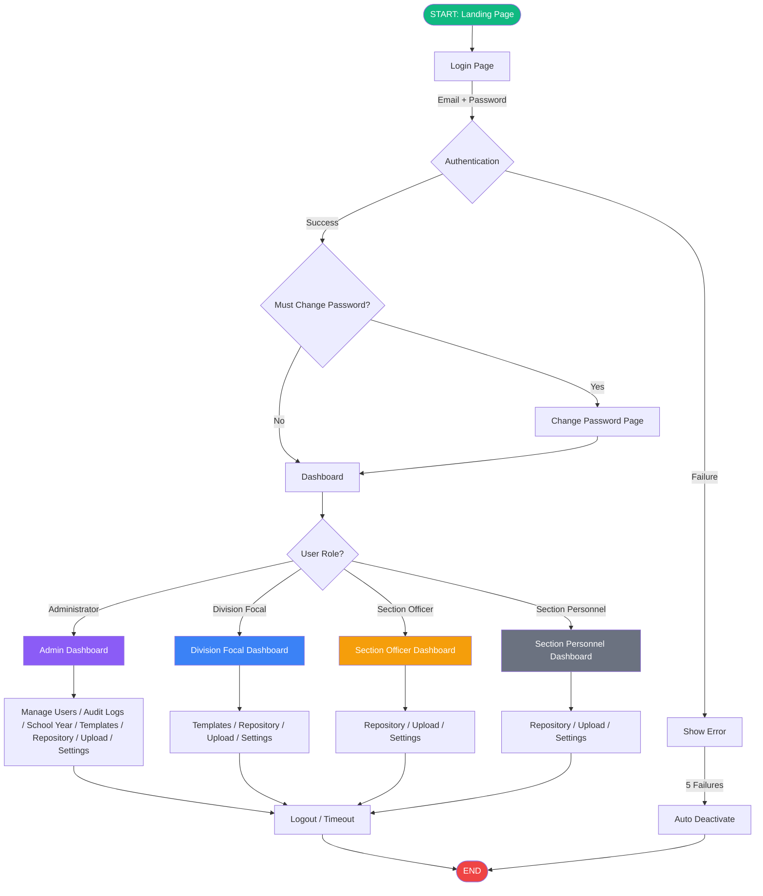

# OneData System — User Roles Flowchart Guide

## Overview

This document provides a guide to creating a flowchart that visualizes all user roles in the OneData system, their entry/exit points, and the functionalities available to each role.

---

## System Entry & Exit Points

### START
- **Public Landing Page** (`/`) — All users begin here
- **Login Page** (`/login`) — Email/password authentication via Supabase Auth

### END
- **Idle Timeout Logout** — Auto sign-out after 30 minutes of inactivity
- **Manual Logout** — User-initiated sign-out
- **Account Deactivated** — Admin deactivates the account
- **Password Lockout** — 5 consecutive failed login attempts auto-deactivates the account

---

## User Roles

| Role | Database Slug | Scope |
|---|---|---|
| Administrator | `administrator` | Full system access — all divisions, all sections |
| Division Focal Person | `division_focal` | Own division — all sections within it |
| Section Officer | `section_focal` | Own section only |
| Section Personnel | `section_personnel` | Own section — limited to own uploads |

---

## Navigation by Role

| Page | Admin | Division Focal | Section Officer | Section Personnel |
|---|---|---|---|---|
| Dashboard | ✅ | ✅ | ✅ | ✅ |
| Repository | ✅ | ✅ | ✅ | ✅ |
| Upload Files | ✅ | ✅ | ✅ | ✅ |
| Templates | ✅ | ✅ | ❌ | ❌ |
| Manage Users | ✅ | ❌ | ❌ | ❌ |
| Audit Logs | ✅ | ❌ | ❌ | ❌ |
| School Year | ✅ | ❌ | ❌ | ❌ |
| Settings | ✅ | ✅ | ✅ | ✅ |

---

## Phase 1: Authentication Flow (All Roles)

```
[START]
  │
  ▼
[Landing Page] ─── Public ─── [About / Contact / CTA]
  │
  ▼
[Login Page]
  │
  ├──► [Enter Email + Password]
  │        │
  │        ├──► [Login Success] ──► [Check: must_change_password?]
  │        │        │
  │        │        ├── YES ──► [Change Password Page] ──► [Dashboard]
  │        │        │
  │        │        └── NO ──► [Dashboard]
  │        │
  │        └──► [Login Failed]
  │                 │
  │                 ├──► [Show Error Message]
  │                 │
  │                 └──► [5 Consecutive Failures] ──► [Auto Deactivate Account] ──► [Security Alert in Audit Logs]
  │
  ├──► [Forgot Password?]
  │        │
  │        ▼
  │    [Enter Email] ──► [Send Reset Link via Brevo] ──► [Check Email] ──► [Change Password Page] ──► [Login]
  │
  ▼
[Session Active]
  │
  ├── [Idle Timer: 25 min] ──► [Warning Dialog: "Stay Logged In?"]
  │        │
  │        ├── [Click "Stay"] ──► [Reset Timer]
  │        │
  │        └── [No Action / Click "Logout"] ──► [Auto Logout] ──► [END]
  │
  ▼
[Dashboard Loaded] ──► [Role-Based Navigation Appears]
```

---

## Phase 2: Administrator

```
[ADMINISTRATOR LOGIN]
  │
  ▼
┌─────────────────────────────────────────────────────┐
│                  ADMIN DASHBOARD                     │
│  • View all enrollment, dropout, promotion analytics │
│  • View all resource inventory charts                │
│  • School year selector (all years)                  │
│  • Scheduled school year transition countdown        │
└──────────────────────┬──────────────────────────────┘
                       │
     ┌─────────────────┼─────────────────────┐
     │                 │                     │
     ▼                 ▼                     ▼
┌──────────┐    ┌───────────┐    ┌──────────────────┐
│ MANAGE   │    │ AUDIT     │    │ SCHOOL YEAR      │
│ USERS    │    │ LOGS      │    │ MANAGEMENT       │
└────┬─────┘    └─────┬─────┘    └────────┬─────────┘
     │                │                    │
     ▼                ▼                    ▼
```

### What Administrator Can Do

**Manage Users**
- View all users (grid/list view, search, filter by division/role/status)
- Create new user (auto-generates temp password, sends onboarding email)
- Edit user (name, ID number, role, division, section)
- Activate / Deactivate user accounts
- Delete user (removes from DB and auth)
- View user's audit log history

**Audit Logs**
- View all audit records (paginated)
- Search by keyword
- Filter by action type, status, date range
- View action stats (uploads, downloads, verifications, deletions)
- Export / Print audit logs
- Handle security alerts (review, deactivate associated account)

**School Year Management**
- View active school year (label, dates, file count, archive countdown)
- View scheduled school year (countdown, reminders)
- Schedule new school year (select year, set dates, activation time)
- Edit / Cancel scheduled year
- Force transition (immediate activation)
- Reopen archived year / Close reopened year
- View previous years table

**Templates**
- View all templates (grouped by division > section)
- Upload template (assign to any section)
- Rename / Reassign / Replace / Delete templates
- Download template (signed URL)

**Repository**
- Full access to ALL divisions and sections
- Create / Delete sections
- Download, Upload, Edit, Delete files
- Verify / Unverify files
- View recycle bin (all files)
- Approve file access requests (any section)
- Approve division access requests (any division)

**Upload Files**
- Select school year
- Choose any folder/section
- Upload general files or structured Excel
- Link existing files

**Settings**
- View profile (name, email, role, division/section, ID, last login)
- Change email (with reauthentication + confirmation email)
- Reset password (send reset link)

---

## Phase 3: Division Focal Person

```
[DIVISION FOCAL PERSON LOGIN]
  │
  ▼
┌─────────────────────────────────────────────────────┐
│              DIVISION FOCAL DASHBOARD                │
│  • View enrollment, dropout, promotion analytics     │
│  • View resource inventory charts                    │
│  • School year selector (scoped to own division)     │
└──────────────────────┬──────────────────────────────┘
                       │
     ┌─────────────────┼──────────────────┐
     │                 │                  │
     ▼                 ▼                  ▼
┌──────────┐    ┌───────────┐    ┌──────────────┐
│ REPOS-   │    │ UPLOAD    │    │ TEMPLATES    │
│ ITORY    │    │ FILES     │    │              │
└────┬─────┘    └─────┬─────┘    └──────┬───────┘
     │                │                  │
     ▼                ▼                  ▼
```

### What Division Focal Person Can Do

**Templates**
- View templates for own division (grouped by section)
- Upload template to any section within own division
- Rename / Reassign / Replace / Delete templates (own division only)
- Download template

**Repository**
- Full access to own division (view, upload, download, delete, verify files)
- Other divisions — request access, locked mode (read-only) if approved
- Approve file access requests (own division)
- Approve division access requests (own division)
- View recycle bin (own division)

**Upload Files**
- Select school year
- Choose section within own division
- Upload general files or structured Excel
- Link existing files

**Settings**
- View profile
- Change email (with reauthentication + confirmation email)
- Reset password (send reset link)

---

## Phase 4: Section Officer

```
[SECTION OFFICER LOGIN]
  │
  ▼
┌─────────────────────────────────────────────────────┐
│              SECTION OFFICER DASHBOARD               │
│  • View enrollment, dropout, promotion analytics     │
│  • View resource inventory charts                    │
│  • School year selector (scoped to own section)      │
└──────────────────────┬──────────────────────────────┘
                       │
     ┌─────────────────┼──────────────────┐
     │                 │                  │
     ▼                 ▼                  ▼
┌──────────┐    ┌───────────┐    ┌──────────────┐
│ REPOS-   │    │ UPLOAD    │    │ SETTINGS     │
│ ITORY    │    │ FILES     │    │              │
└────┬─────┘    └─────┬─────┘    └──────┬───────┘
     │                │                  │
     ▼                ▼                  ▼
```

### What Section Officer Can Do

**Repository**
- Full access to own section (view, upload, download, delete, verify files)
- Other sections in division — request access, locked if approved
- Other divisions — request access, locked if approved
- Approve file access requests (own section only)
- Submit section deletion request (admin approves)
- View recycle bin (own section)

**Upload Files**
- Select school year
- Auto-assigned to own section
- Upload general files or structured Excel
- Link existing files

**Settings**
- View profile
- Change email (with reauthentication + confirmation email)
- Reset password (send reset link)

---

## Phase 5: Section Personnel

```
[SECTION PERSONNEL LOGIN]
  │
  ▼
┌─────────────────────────────────────────────────────┐
│             SECTION PERSONNEL DASHBOARD              │
│  • View enrollment, dropout, promotion analytics     │
│  • View resource inventory charts                    │
│  • School year selector (scoped to own section)      │
└──────────────────────┬──────────────────────────────┘
                       │
     ┌─────────────────┼──────────────────┐
     │                 │                  │
     ▼                 ▼                  ▼
┌──────────┐    ┌───────────┐    ┌──────────────┐
│ REPOS-   │    │ UPLOAD    │    │ SETTINGS     │
│ ITORY    │    │ FILES     │    │              │
└────┬─────┘    └─────┬─────┘    └──────┬───────┘
     │                │                  │
     ▼                ▼                  ▼
```

### What Section Personnel Can Do

**Repository**
- View, download, upload files in own section
- Delete only own uploaded files
- Edit own Excel files
- Other sections/divisions — request access, locked if approved
- Can only request file access (cannot approve)
- Recycle bin — own files only
- View/download templates (cannot manage)

**Upload Files**
- Select school year
- Auto-assigned to own section
- Upload general files or structured Excel
- Link existing files

**Settings**
- View profile
- Change email (with reauthentication + confirmation email)
- Reset password (send reset link)

---

## Phase 6: Common Features (All Roles)

### Dashboard Analytics
- Enrollment stats (total, public/private, gender, by level)
- Dropout rates by level
- Promotion rates by level
- Cohort survival rate
- Resource inventory (teachers, classrooms, seats, textbooks vs needs)
- CESPES analytics (operations, support, admin, performance, innovation)
- Performance indicators / KPIs
- School year selector to filter data

### Notifications (Realtime)
- File uploaded, verified, unverified, deleted
- File access request submitted, approved, denied, revoked
- Division access request submitted, approved, denied, revoked
- Mark read, mark all read, delete, clear all

---

## Phase 7: Access Control Summary

| Scenario | Administrator | Division Focal | Section Officer | Section Personnel |
|---|---|---|---|---|
| Own section files | Full | Full | Full | View/Upload |
| Own division (other section) | Full | Full | Locked (request) | Locked (request) |
| Other division | Full | Locked (request) | Locked (request) | Locked (request) |
| Verify files | All | Own division | Own section | No |
| Delete files | All | Own division | Own section | Own uploads only |
| Approve file requests | Any | Own division | Own section | No |
| Approve division requests | Any | Own division | No | No |
| Manage templates | All | Own division | View only | View only |
| Create sections | Yes | Own division | No | No |
| Delete sections | Approve only | Request only | No | No |

### Access Levels
- **Full** — View, download, upload, delete, verify, edit, recycle bin, manage templates
- **Locked** — Read-only view, can download, can request access
- **Blocked** — Redirected to access denied page, can request division-level access

---

## Phase 8: Notification Flow

```
[Event Occurs]
  │
  ├── [File Uploaded] ──► [Notify: section_focal, section_personnel in same section]
  │
  ├── [File Verified] ──► [Notify: uploader]
  │
  ├── [File Unverified] ──► [Notify: uploader]
  │
  ├── [File Deleted] ──► [Notify: section_focal in same section]
  │
  ├── [File Access Request Submitted]
  │        │
  │        └──► [Notify: section_focal (own section), division_focal (own division), admin]
  │
  ├── [File Access Request Approved/Denied/Revoked]
  │        │
  │        └──► [Notify: requester]
  │
  ├── [Division Access Request Submitted]
  │        │
  │        └──► [Notify: division_focal (target division), admin]
  │
  ├── [Division Access Request Approved/Denied/Revoked]
  │        │
  │        └──► [Notify: requester]
  │
  └── [Section Deletion Request Submitted]
           │
           └──► [Notify: admin]
```

---

## Phase 9: End States (All Roles)

```
[Active Session]
  │
  ├──► [Manual Logout] ──► [END]
  │
  ├──► [Idle Timeout: 30 min] ──► [Auto Logout] ──► [END]
  │
  ├──► [Account Deactivated by Admin]
  │        │
  │        ├── [Next Login Attempt] ──► [Error: "Account is deactivated"]
  │        └── [Current Session] ──► [Session invalidated on next action]
  │
  ├──► [Password Lockout: 5 Failed Attempts]
  │        │
  │        └──► [Auto Deactivate Account] ──► [Security Alert in Audit Logs]
  │
  ├──► [Session Expires] ──► [Redirect to Login] ──► [END]
  │
  └──► [Browser Close] ──► [Session persists until timeout or manual logout]
```

---

## Visual Flowchart Summary (Mermaid Format)



---

## File References

| Component | Source File |
|---|---|
| Role Definitions | `src/utils/accessControl.js` |
| Auth Flow | `src/components/LoginPageComponents/LoginForm.jsx` |
| Session Management | `src/App.jsx` |
| Idle Timeout | `src/hooks/useIdleTimeout.js` |
| Route Guards | `src/components/ProtectedRoute.jsx`, `src/components/RoleProtectedRoute.jsx` |
| Navigation (Desktop) | `src/components/Sidebar.jsx` |
| Navigation (Mobile) | `src/components/MobileBottomNav.jsx` |
| User Management | `src/pages/ManageUsers/ManageUsers.jsx` |
| Audit Logs | `src/pages/AuditLogs/AuditLogs.jsx` |
| School Year | `src/pages/SchoolYear/SchoolYearPage.jsx` |
| Templates | `src/pages/Templates/TemplatesPage.jsx` |
| Repository | `src/pages/Repository/Repository.jsx` |
| Repository Folder | `src/pages/Repository/RepositoryFolderDetailPage.jsx` |
| Upload Files | `src/pages/UploadFiles/UploadFilesPage.jsx` |
| Settings | `src/pages/Settings/SettingsPage.jsx` |
| Notifications | `src/hooks/useNotifications.js`, `src/utils/notifications.js` |
| Access Control | `src/utils/accessControl.js` |
| File Access Requests | `src/utils/accessRequestsApi.js` |
| Division Access Requests | `src/utils/divisionAccessRequestsApi.js` |
| Section Deletion | `src/utils/sectionDeletion.js` |
| Structured Data Sync | `src/utils/structuredDataSync.js` |
| User Context | `src/contexts/UserContext.jsx` |
| Supabase Client | `src/lib/supabaseClient.js` |
| Edge Functions | `supabase/functions/*/index.ts` |
| Express Server | `server/index.js` |
| Dashboard | `src/pages/Dashboard/Dashboard.jsx` |
| Landing Page | `src/pages/LandingPage/LandingPage.jsx` |
| Password Rules | `src/utils/passwordRules.js` |

---

*Generated from OneData codebase analysis — September 2026*
